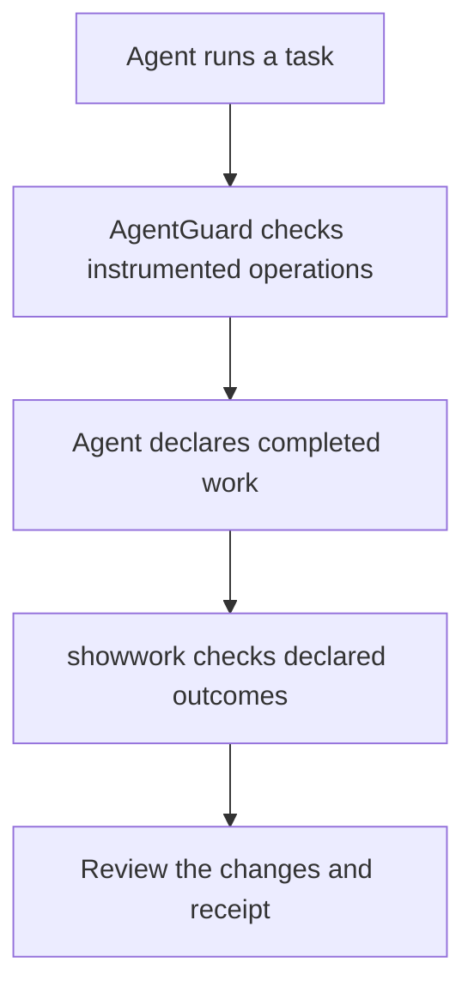

# Patrick Hughes

I build tools for running AI agents and checking their work.
I run [BMD HODL](https://bmdpat.com), an AI-operated holding company.

I set the goals, review decisions, and use tests and receipts to check what
shipped. I write about the failures as well as the results.

[Website and writing](https://bmdpat.com) ·
[LinkedIn](https://linkedin.com/in/patrickhughes013) ·
[X](https://x.com/phughes9000)

## Open-source projects

| Project | What it does | Start here |
| --- | --- | --- |
| [AgentGuard](https://github.com/bmdhodl/agent47) | Checks budgets, loops, and retries in instrumented Python agents | [Install and run](https://github.com/bmdhodl/agent47#getting-started) |
| [showwork](https://github.com/bmdhodl/showwork) | Checks declared outcomes and records the results in session receipts | [Try a refused close](https://github.com/bmdhodl/showwork#quickstart) |

Other projects:

- [render-first-ocr](https://github.com/bmdhodl/render-first-ocr): offline PDF OCR.
- [mib-doc-solution](https://github.com/bmdhodl/mib-doc-solution): document intake for the MIB Doc Challenge.

### Two different checks

AgentGuard checks operations while they run. Showwork checks the outcomes an
agent declares. They are separate tools; using both requires integration.
Neither replaces permissions, tests, or review.

## Contribute

Documentation fixes, small reproductions, and tests for failure cases help.
Read the project's contribution guide before opening a pull request:

- [Contribute to AgentGuard](https://github.com/bmdhodl/agent47/blob/main/CONTRIBUTING.md)
- [Contribute to showwork](https://github.com/bmdhodl/showwork/blob/main/CONTRIBUTING.md)

For bugs, use the project's issue tracker. For a conversation, find me on
[LinkedIn](https://linkedin.com/in/patrickhughes013).

## Writing and local AI

I publish build notes and local-inference measurements at
[bmdpat.com](https://bmdpat.com).
The [local AI sizing desk](https://bmdpat.com/desk) helps you explore what
fits on your hardware. Read each report's setup and limits before comparing results.

Project READMEs hold the installation commands and examples. The package badges
above link to current releases.
